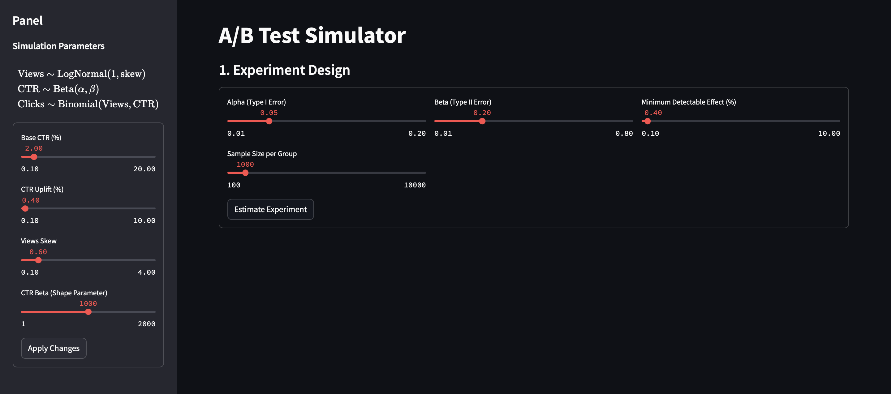

# **A/B Test Simulator**
### _"One Tool to Simulate Them All"_

Welcome, brave data explorer! This repository contains the **A/B Test Simulator**, a powerful application designed to guide you through the labyrinth of experimentation and analysis. Just as Frodo carried the One Ring to Mordor, this app empowers you to carry out A/B testing simulations to achieve statistical clarity.

---

## **Features**
-  **Data Generation Model**
    - Generate views, CTRs (Click-Through Rates), and clicks using probabilistic models.
    - Easily configure parameters like Base CTR, Uplift, and Skew.
-  **Experiment Design**
    - Estimate sample sizes using statistical thresholds (Type I Error, Type II Error, MDE).
    - Visualize your assumptions in real-time.
-  **Powerful Analysis**
    - Compare A/A and A/B test results using various statistical tests:
        - T-tests, Mann-Whitney U test, Binomial test, and Bootstrap.
    - Visualize p-value distributions and calculate statistical power.

---

## **How It Works**
### _"Even the smallest parameter can change the course of experimentation."_

1. **Data Generation**:  
    Configure parameters such as:
    - **Base CTR (%)**: The baseline click-through rate.
    - **CTR Uplift (%)**: The expected uplift between the control and treatment groups.
    - **Views Skew**: Adjust skewness for user views distribution.
    - **CTR Beta**: Set the Beta distribution's shape parameter.


2. **Experiment Design**:  
    Craft an experiment with:
    - **Alpha (Type I Error)**: The significance level.
    - **Beta (Type II Error)**: The power of your test.
    - **MDE (%)**: The minimum detectable effect.

    Interactive sliders help you fine-tune these parameters. Here's a glimpse of the design interface:  
    

3. **Results Visualization**:  
    Explore the "ground truth" distributions under null (**H0**) and alternative (**H1**) hypotheses:
    - **RESULTS**:  
        


4. **A/A and A/B Analysis**:  
    - Plot p-value histograms and cumulative distribution functions.
    - Calculate statistical power to determine the effectiveness of your test.

---

## **Setup**
### _"Even the smallest repository can hold great power."_

To begin your journey:
1. Clone this repository:
   ```bash
   git clone https://github.com/your-repo/ab-test-simulator.git
   cd ab-test-simulator

2. Install Dependencies:
   ```bash
   pip install -r requirements.txt

3. Run the app:
   ```bash
   streamlit run ABTEST_app.py

## **Technologies**

- Python: The wizardry behind the calculations.
- Streamlit: The elvish interface to interact with data.
- NumPy, SciPy, Seaborn: Tools of the dwarves, known for crafting statistical and visualization wonders.
   
   
